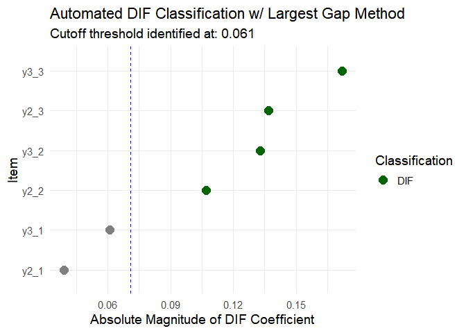

<!-- README.md is generated from README.Rmd. Please edit that file -->

# gfactharm: A Stepwise Data Harmonization Framework

<!-- badges: start -->

<!-- badges: end -->

gfactharm implements the refined harmonization framework for
longitudinal cognitive data developed by Lang et al. (2024).

The goal of gfactharm is to implements a step-wise data harmonization
procedure assuming a second-order general factor. Features include
Exploratory Factor Analysis (EFA) for structure identification,
Confirmatory Factor Analysis (CFA) for validation, Differential Item
Functioning (DIF) detection for measurement invariance, and multi-group
data Harmonization.

## Installation

You can install the development version of gfactharm from
[GitHub](https://github.com/) with:

``` r
# Install the development version from GitHub:
# You may need to install remotes first if you don't have it
# install.packages("remotes") 
remotes::install_github("rrrrrrrlll/gfactharm")
#> Using GitHub PAT from the git credential store.
#> Skipping install of 'gfactharm' from a github remote, the SHA1 (1a65a7f9) has not changed since last install.
#>   Use `force = TRUE` to force installation

# Load the package
library(gfactharm)
```

## Example

This is a basic example of creating `harm_model` S3 object and run part
of harmonization pipeline. For the full pipeline, please knit the
vignette under the vignette folder for an example use of the main
functions in the package.

``` r
library(gfactharm)
library(dplyr)
#> Warning: 程序包'dplyr'是用R版本4.4.3 来建造的
#> 
#> 载入程序包：'dplyr'
#> The following objects are masked from 'package:stats':
#> 
#>     filter, lag
#> The following objects are masked from 'package:base':
#> 
#>     intersect, setdiff, setequal, union

# load example data
pathA <- system.file("extdata", "A.csv", package = "gfactharm")
pathB <- system.file("extdata", "BNO.csv", package = "gfactharm")
A <- read.csv(pathA)
B <- read.csv(pathB)

# Define model structure
cohorts <- c("A", "B")

domain_order <- c('fa1', 'fa2', 'f2', 'f3')

c_d_t_map <- list(  # Specify factor relations
    A = list(
        f1 = c("ya1_1", "ya1_2", "ya1_3"),
        f2 = c("y2_1", "y2_2", "y2_3"),
        f3 = c("y3_1", "y3_2", "y3_3")
    ),
    B = list(
        f1 = c("yb1_1", "yb1_2", "yb1_3"),
        f2 = c("y2_1", "y2_2", "y2_3"),
        f3 = c("y3_1", "y3_2", "y3_3")
    ),
    BUNI = list(
        f1 = c("yb1_1", "yb1_2", "yb1_3"),
        f2 = c("y2_1", "y2_2", "y2_3"),
        f3 = c("y3_1", "y3_2", "y3_3")
    ),
    BNONUNI = list(
        f1 = c("yb1_1", "yb1_2", "yb1_3"),
        f2 = c("y2_1", "y2_2", "y2_3"),
        f3 = c("y3_1", "y3_2", "y3_3")
    )
)

# Integrate data into a list
data_list <- list(A = A, B = B)

# Create master object
sim_model <- specify_model(cohorts                = cohorts,
                           cohort_domain_test_map = c_d_t_map,
                           covariate_lst          = NULL,
                           preferred_domain_order = domain_order,
                           data                   = data_list,
                           group_var              = 'cohort')


# cfa
cfa_fit2 <- fit1st(sim_model,
              selected_items = c('y2_1', 'y2_2', 'y2_3',
                                 'y3_1', 'y3_2', 'y3_3'),
              selected_cohorts = c('A', 'B'))
#> [1] "A"
#> [1] "B"
lavaan::summary(cfa_fit2$A)
#> lavaan 0.6-20 ended normally after 19 iterations
#> 
#>   Estimator                                         ML
#>   Optimization method                           NLMINB
#>   Number of model parameters                        19
#> 
#>   Number of observations                          3000
#> 
#> Model Test User Model:
#>                                                       
#>   Test statistic                                 7.838
#>   Degrees of freedom                                 8
#>   P-value (Chi-square)                           0.449
#> 
#> Parameter Estimates:
#> 
#>   Standard errors                             Standard
#>   Information                                 Expected
#>   Information saturated (h1) model          Structured
#> 
#> Latent Variables:
#>                    Estimate  Std.Err  z-value  P(>|z|)
#>   f2 =~                                               
#>     y2_1              0.985    0.024   40.522    0.000
#>     y2_2              1.945    0.039   49.298    0.000
#>     y2_3              2.946    0.054   54.151    0.000
#>   f3 =~                                               
#>     y3_1              0.994    0.024   41.883    0.000
#>     y3_2              1.990    0.040   49.893    0.000
#>     y3_3              3.002    0.056   54.023    0.000
#> 
#> Covariances:
#>                    Estimate  Std.Err  z-value  P(>|z|)
#>   f2 ~~                                               
#>     f3                0.623    0.015   42.790    0.000
#> 
#> Intercepts:
#>                    Estimate  Std.Err  z-value  P(>|z|)
#>     f2                0.000                           
#>     f3                0.000                           
#>    .y2_1             -0.002    0.026   -0.061    0.951
#>    .y2_2              0.009    0.044    0.201    0.840
#>    .y2_3              0.046    0.062    0.733    0.463
#>    .y3_1              0.014    0.026    0.556    0.578
#>    .y3_2              0.027    0.045    0.607    0.544
#>    .y3_3              0.037    0.064    0.581    0.561
#> 
#> Variances:
#>                    Estimate  Std.Err  z-value  P(>|z|)
#>     f2                1.000                           
#>     f3                1.000                           
#>    .y2_1              1.055    0.032   32.640    0.000
#>    .y2_2              2.029    0.081   25.119    0.000
#>    .y2_3              2.894    0.157   18.438    0.000
#>    .y3_1              0.975    0.030   32.097    0.000
#>    .y3_2              2.048    0.082   24.978    0.000
#>    .y3_3              3.129    0.161   19.373    0.000

# DIF detection
dif_res3 <- dif_analysis(
    model = sim_model,
    target_items = c('y2_1', 'y2_2', 'y2_3', 'y3_1', 'y3_2', 'y3_3'),
    target_cohorts = c('A', 'B')
)
#> 
#> --- Running LASSO Restriction Test ---
#> Successfully built dataframe with 6000 observations for 2 group(s) and 6 item(s).
#> --- Fitting the following MIMIC model ---
#> # --- Latent variable definitions ---
#> f2 =~ NA*y2_1 + NA*y2_2 + NA*y2_3
#> f3 =~ NA*y3_1 + NA*y3_2 + NA*y3_3
#> 
#> # --- Fixation of variances ---
#> f2 ~~ 1*f2
#> f3 ~~ 1*f3
#> 
#> # --- Group Variable Regression ---
#> f2 + f3 ~ cohort
#> y2_1 ~ dif1*cohort
#> y2_2 ~ dif2*cohort
#> y2_3 ~ dif3*cohort
#> y3_1 ~ dif4*cohort
#> y3_2 ~ dif5*cohort
#> y3_3 ~ dif6*cohort
#> -----------------------------------------
#> 
#> Running regularized SEM with LASSO penalty. This may take a moment...
#> Warning: lavaan->lav_model_vcov():  
#>    Could not compute standard errors! The information matrix could not be 
#>    inverted. This may be a symptom that the model is not identified.
#> Analysis complete.
#> 
#> --- LASSO DIF Detection Results ---
#> $call
#> regsem::regsem(model = initial_fit, type = "lasso", gradFun = "ram", 
#>     pars_pen = dif_labels)
#> 
#> $estimates
#>   f2 -> y2_1 f2 -> y2_2 f2 -> y2_3 f3 -> y3_1 f3 -> y3_2 f3 -> y3_3
#> 1      0.978      1.917      2.928      0.939      1.911      2.845
#>   cohort -> f2 cohort -> f3 cohort -> y2_1 cohort -> y2_2 cohort -> y2_3
#> 1        0.658        0.836          0.039          0.107          0.137
#>   cohort -> y3_1 cohort -> y3_2 cohort -> y3_3 y2_1 ~~ y2_1 y2_2 ~~ y2_2
#> 1          0.061          0.133          0.172        1.017        2.055
#>   y2_3 ~~ y2_3 y3_1 ~~ y3_1 y3_2 ~~ y3_2 y3_3 ~~ y3_3 f2 ~~ f3
#> 1        2.893        0.989        2.067        2.987    0.613
#> 
#> $returnVals
#>       convergence df          fit rmsea BIC
#> rmsea           0  6 0.0004788804     0  NA
#> 
#> attr(,"class")
#> [1] "summary.regsem"
#>             label   est  lhs abs_est Classification
#> 9  cohort -> y2_1 0.039 y2_1   0.039         No DIF
#> 12 cohort -> y3_1 0.061 y3_1   0.061         No DIF
#> 10 cohort -> y2_2 0.107 y2_2   0.107            DIF
#> 13 cohort -> y3_2 0.133 y3_2   0.133            DIF
#> 11 cohort -> y2_3 0.137 y2_3   0.137            DIF
#> 14 cohort -> y3_3 0.172 y3_3   0.172            DIF
```



    #> Estimation of regression coefficent and classification of DIF:
    #>     lhs   est abs_est Classification
    #> 9  y2_1 0.039   0.039         No DIF
    #> 12 y3_1 0.061   0.061         No DIF
    #> 10 y2_2 0.107   0.107            DIF
    #> 13 y3_2 0.133   0.133            DIF
    #> 11 y2_3 0.137   0.137            DIF
    #> 14 y3_3 0.172   0.172            DIF
    #> Be aware that LASSO restriction test may be inaccurate when no DIF presents.
    #> Run MIMIC test?
    #> (y/n):
    #> Stopping function.

    # Harmonization
    final_res <- harmonization(sim_model)
    #> All harmonization inputs are valid.
    #> 1 in 2 cohorts has been harmonized.
    #> 
    #> --- Harmonizing Cohort: B ( 1 of 1 ) ---
    #>   Items (No DIF): 9 
    #>   Items (Uni DIF): 0 
    #>   Items (NonUni DIF): 0 
    #>   [No DIF] Fixed: 6 | Free: 3 
    #>   [Uni DIF] Fixed: 0 | Free: 0 
    #>   [NonUni DIF] Fixed: 0 | Free: 0
    #> Warning: lavaan->lav_model_vcov():  
    #>    Could not compute standard errors! The information matrix could not be 
    #>    inverted. This may be a symptom that the model is not identified.
    #>   Cohort B harmonized.
    #> Harmonizarion Completed.

## License

This package is licensed under the GPL-3 license.

## References

1.  Lang, L., et al. (2024). Development of a refined harmonization
    approach for longitudinal cognitive data in people with HIV.
    *Journal of Clinical Epidemiology*, 178,
    111620.[doi:10.1016/j.jclinepi.2024.111620](https://doi.org/10.1016/j.jclinepi.2024.111620)
2.  Lang, L., et al. (2025). International application of an optimized
    harmonization approach for longitudinal cognitive data in people
    with HIV. *Journal of Clinical Epidemiology*, 188, 111972.
    [doi:10.1016/j.jclinepi.2025.111972](https://doi.org/10.1016/j.jclinepi.2025.111972)
