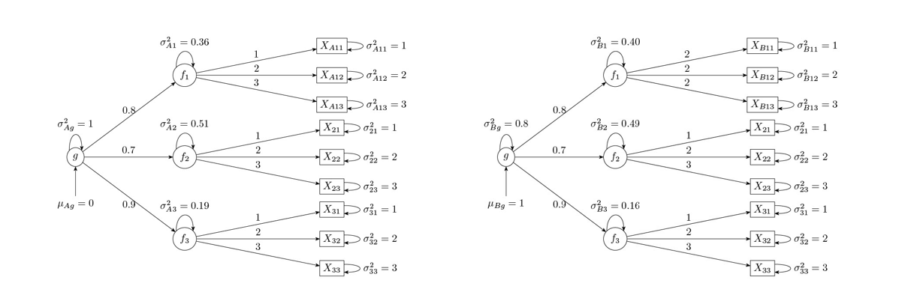

```{r, include = FALSE}
knitr::opts_chunk$set(
  collapse = TRUE,
  comment = "#>"
)
```

```{r, setup}
library(gfactharm)
library(dplyr)
knitr::opts_chunk$set(
  collapse = TRUE,
  comment = "#>",
  fig.width = 7,       # Controls the internal canvas width
  fig.height = 5,      # Controls the internal canvas height
  out.width = "100%"   # Controls the display width in HTML
)
```

# Introduction

`gfactharm` provides a streamlined pipeline for psychometric analysis, moving from exploratory structure detection to cross-study data harmonization. This package is based assumption of second-order linear model with a single general factor. This package is designed to help researchers ensure that latent constructs are measured consistently across different populations before pooling data.

The package implements a step-wise framework:

1. EFA: Explore the underlying structure of your items.

2. Define Model: confirm the model structure.

3. Validation: assess model fit(CFA) and detect Differential Item Functioning(DIF) across groups.

4. Harmonization: Adjust scores to make them comparable.

## Example with Simulated Data

We use four simulated datasets for demonstration. `A`, `B` are two datasets generated through similar second-order model, with same mean, variance and loadings for each shared items. They each three cohort `f1`, `f2` and `f3`, the first measured by distinct items, the latter two measured by same items.

```{r, echo=FALSE, out.width="100%", fig.align='center', fig.cap="example simulation"}

```

In addition, `BUNI` and `BNONUNI` are adaptations of `B` by adding uniform/nonuniform DIF onto each item in `f3`.

## Step 1: EFA

First, we examine the underlying structure of the raw data.

```{r, load data}
# Load example data
pathA <- system.file("extdata", "A.csv", package = "gfactharm")
pathB1 <- system.file("extdata", "BNO.csv", package = "gfactharm")
pathB2 <- system.file("extdata", "BUNI.csv", package = "gfactharm")
pathB3 <- system.file("extdata", "BNONUNI.csv", package = "gfactharm")

A <- read.csv(pathA)            # Simulated cohort A
B <- read.csv(pathB1)           # Simulated cohort B, no DIF from A in any shared items
BUNI <- read.csv(pathB2)        # B modified to show uniform DIF
BNONUNI <- read.csv(pathB3)     # B modified to show non-uniform DIF
```

```{r efa}
# Run EFA to suggest factor structure
# Function will suggest number of factor if not specified
efa_res <- run_efa(A, nfactors = NULL, show_plot = TRUE)

# Print the result of fitness
summary(efa_res$fit)
```

## Step 2: Define the Model Object

Based on the EFA results, we define a harmonization object(`harm_model`). This object will store model structure, the data, and all subsequent analysis settings. This object will be essential for every following step.

Define model structure requires:

1. `cohorts`: A vector or list of all cohorts, the harmonization will follow its order.

2, `cohort_domain_test_map`: A named list stating link of items and domains of each cohort.

3, `domain_order`: Optional. A character vector or list deciding order of damain in layout.

Note that model syntax is not needed in creating `harm_model`, as a suitable syntax will be automatically created under each task.

```{r, define object}
# Define model structure based on efa result
cohorts <- c("A", "B", "BUNI", "BNONUNI")

domain_order <- c('f1', 'f2')

c_d_t_map <- list(
    A = list(
        f1 = c("ya1_1", "ya1_2", "ya1_3"),
        f2 = c("y2_1", "y2_2", "y2_3"),
        f3 = c("y3_1", "y3_2", "y3_3")
    ),
    B = list(
        f1 = c("yb1_1", "yb1_2", "yb1_3"),
        f2 = c("y2_1", "y2_2", "y2_3"),
        f3 = c("y3_1", "y3_2", "y3_3")
    ),
    BUNI = list(
        f1 = c("yb1_1", "yb1_2", "yb1_3"),
        f2 = c("y2_1", "y2_2", "y2_3"),
        f3 = c("y3_1", "y3_2", "y3_3")
    ),
    BNONUNI = list(
        f1 = c("yb1_1", "yb1_2", "yb1_3"),
        f2 = c("y2_1", "y2_2", "y2_3"),
        f3 = c("y3_1", "y3_2", "y3_3")
    )
)

# Integrate data into a list
data_list <- list(
    A = A,
    B = B,
    BUNI = BUNI,
    BNONUNI = BNONUNI
)

# Create master object
sim_model <- specify_model(cohorts                = cohorts,
                           cohort_domain_test_map = c_d_t_map,
                           covariate_lst          = NULL,
                           preferred_domain_order = domain_order,
                           data                   = data_list,
                           group_var              = 'cohort')

# Check the object
print(sim_model$cohort_domain_map)
print(sim_model$domain_test_map)
```

## Step 3: Validation

Now we pass the `harm_model` into the validation functions. Note how we don't need to specify the data or structure again; they are carried inside the object.

### CFA

Two distinct functions will carry out the task of fitting:

1. The naive first-order linear model.

2. The second-order linear model with a general factor.

Fitting first-order fitting is necessary step to insure the validity of our second-order model. The function can carry out fittings of one or multiple groups, but `selected_items` must be identifiable in all selected groups.

```{r cfa1}
# One group
cfa_fit1 <- fit1st(sim_model,
              selected_items = c('ya1_1', 'ya1_2', 'ya1_3', 
                                 'y2_1', 'y2_2', 'y2_3', 
                                 'y3_1', 'y3_2', 'y3_3'),
              selected_cohorts = 'A')
lavaan::summary(cfa_fit1)

# Multiple groups
cfa_fit2 <- fit1st(sim_model,
              selected_items = c('y2_1', 'y2_2', 'y2_3',
                                 'y3_1', 'y3_2', 'y3_3'),
              selected_cohorts = c('A', 'B', 'BUNI'))
lavaan::summary(cfa_fit2$A)
```

If the first-order model fits well, we proceed to fit the general factor model.

```{r cfa2}
# One group
cfa_fit3 <- fit2nd(sim_model,
              selected_items = c('yb1_1', 'yb1_2', 'yb1_3',
                                 'y2_1', 'y2_2', 'y2_3',
                                 'y3_1', 'y3_2', 'y3_3'),
              selected_cohorts = 'B')
lavaan::summary(cfa_fit3)

# Multiple groups
cfa_fit4 <- fit2nd(sim_model,
              selected_items = c('y2_1', 'y2_2', 'y2_3',
                                 'y3_1', 'y3_2', 'y3_3'),
              selected_cohorts = c('A', 'B', 'BUNI'))
lavaan::summary(cfa_fit4$A)
```

### DIF Detection

Multiple Indicators, Multiple Causes(MIMIC) method and LASSO regulation analysis will be used in detecting uniform DIF. 

MIMIC is the most common approach of uniform DIF detection; however, for each latent variable, at least one of its item must be ruled out of suspicion, which we call anchor item.

To ensure anchor item exist for each domain, we can first apply LASSO Regulation. It create regressions from selected items to the group variable, and adds penalty on their coefficients. In each concerned domain, the item with least absolute coefficient will be set as anchor for Performing MIMIC.

```{r dif}
# DIF detection - LASSO
dif_res1 <- lasso_restriction(
    model = sim_model,
    target_items = c('y2_1', 'y2_2', 'y2_3', 'y3_1', 'y3_2', 'y3_3'),
    target_cohorts = c('A', 'BUNI')
)

# DIF detection - MIMIC
dif_res2 <- mimic(
    model = sim_model,
    target_items = c('y2_1', 'y2_2', 'y2_3', 'y3_1', 'y3_2', 'y3_3'),
    target_cohorts = c('A', 'BUNI'),
    anchors = c('y2_1', 'y3_2')
)

# DIF detection - combined
dif_res3 <- dif_analysis(
    model = sim_model,
    target_items = c('y2_1', 'y2_2', 'y2_3', 'y3_1', 'y3_2', 'y3_3'),
    target_cohorts = c('A', 'BUNI')
)
```

## Step 4: Final Harmonization

Finally, we generate the harmonized scores. The function requires two named list stating the uniform and non-uniform of each item in each cohort.

```{r harm}
unidif <- list(
    y3_1 = list('BUNI'),
    y3_2 = list('BUNI'),
    y3_3 = list('BUNI')
)

nonunidif <- list(
    y3_1 = list('BNONUNI'),
    y3_2 = list('BNONUNI'),
    y3_3 = list('BNONUNI')
)

final_res <- harm(sim_model, unidif, nonunidif)
print(final_res$fit_results)
print(lavaan::summary(final_res$fit_results$B))
```

``` {r, factor score}
# get score list
scores_list <- lapply(names(final_res$fit_results), function(grp_name) {
    fs <- lavaan::lavPredict(final_res$fit_results[[grp_name]])
    df <- as.data.frame(fs)
    df$cohort <- grp_name
    return(df)
})
  
# Combine into one df
all_scores <- final_res$factor_scores

# plot density of factor scores for each cohort
library(ggplot2)
plot_cols <- setdiff(names(all_scores), "cohort")

for (col in plot_cols) {
  p <- ggplot(all_scores, aes(x = .data[[col]], fill = cohort)) +
    geom_density(alpha = 0.5) +
    labs(title = paste("Density plot of", col), x = col) +
    theme_minimal()
  
  print(p)
}
```

Note that user can state DIF groups by concatenate cohort names. For example, given two extra cohorts: `C` and `D`, the code below states that for item `y3_1`, there is no uniform DIF between `BUNI` and `C`, but they is DIF from them to `D`.

```{r harm2}
unidif <- list(
    y3_1 = list(c('BUNI', 'C'), 'D'),
    y3_2 = list('BUNI'),
    y3_3 = list('BUNI')
)
```

